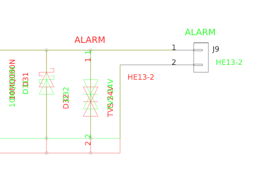

[](https://travis-ci.org/jnavila/plotkicadsch)[](https://ci.appveyor.com/project/jnavila/plotkicadsch)

# Kicad schematic plotter

PlotKicadsch is a small tool to export Kicad Sch files to SVG pictures. In the future, export to other formats may be available (PDF, PNG).

This package also provides the [`plotgitsch`](https://jnavila.github.io/plotkicadsch/plotgitsch_usersguide.html) command which allows to visually compare git revisions of schematics:



For more information type `plotgitsch --help`.

## Objectives

This project is mainly an attempt at using ocaml with functional programing on a pet real-world project.

The quality of the output is not a first requirement (meaning: not supposed to match Kicad one to one), but the accuracy of positioning matters.

# Installation

# Stable version from OPAM

The stable version of plotkicadsch can be installed with [opam](http://opam.ocaml.org/). Be careful to install opam v2.0 for your platform.

```bash
opam switch create 4.09.1
opam switch 4.09.1
eval `opam config env`
opam update
opam install plotkicadsch
```

If you don't use opam consult the .opam files for build instructions.

## Windows

For Windows users, there is an [experimental opam repository](https://fdopen.github.io/opam-repository-mingw/) which works pretty well.

Alternatively, you can simply grab precompiled binaries at

https://github.com/jnavila/plotkicadsch/releases

If you have installed git for windows, chances are that you have installed the bash environment, so  drop the binaries in `C:\Program Files\Git\mingw64\bin`(Administrator rights required). They should be accessible on your bash command line and work just like under Linux/OSX.

# Master version

The latest running version can also be installed from this repo by pinning the project in opam:

```bash
opam switch create 4.09.1
opam switch 4.09.1
eval `opam config env`
opam pin add kicadsch .
opam pin add plotkicadsch .
opam update
opam install plotkicadsch
```

# How to

## Using

All the commands have a help option. For `plotgitsch`, a [small hands on guide](https://jnavila.github.io/plotkicadsch/plotgitsch_usersguide.html) is available.

## Contributing

This project accepts GitHub pull requests, but as it is a self-teaching project, I would prefer to do all the core stuff. If you see some parts of the code whose style is not ocamlish or not FP ready, please let me know.

If this project happens to be of any use, let me know also!
