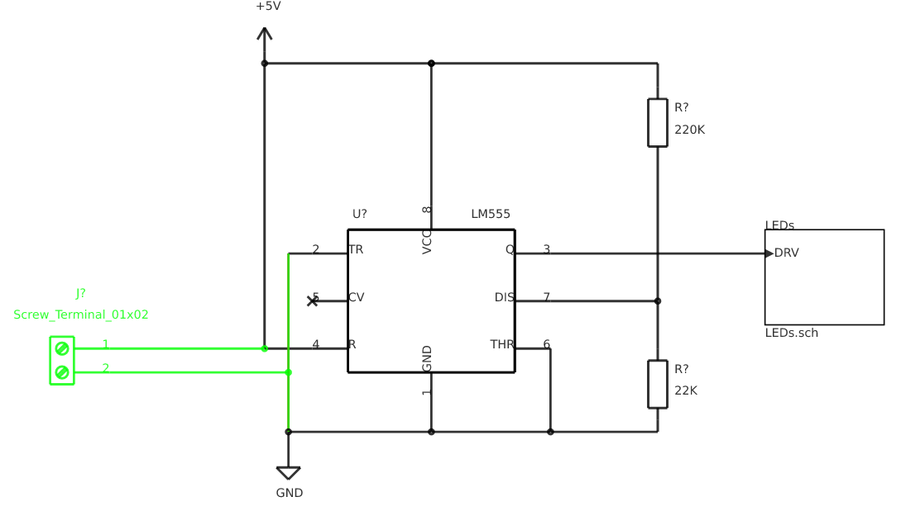
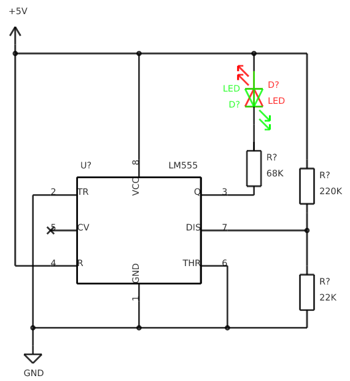
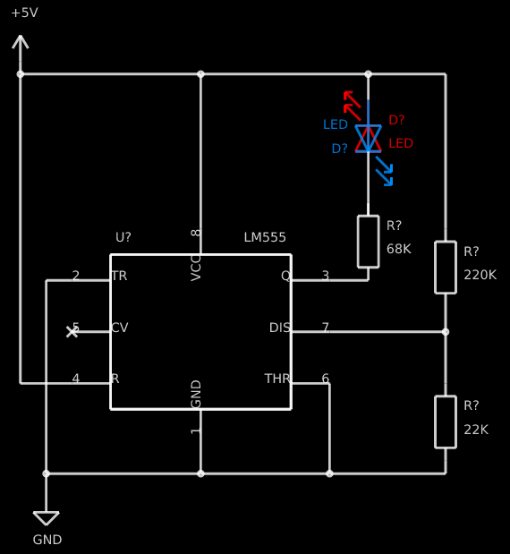
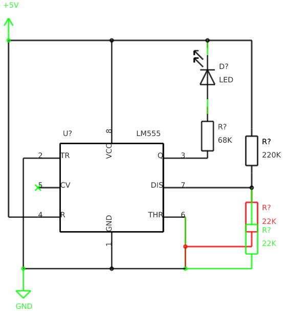
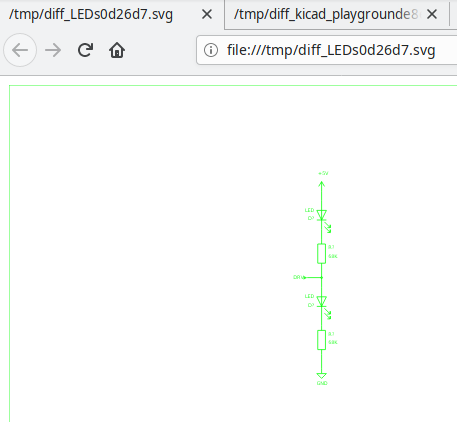

= Plotgitsch User's Guide
Jean-Noël Avila <jn.avila@free.fr>
:toc:
:icons: font

== Introduction

Plotgitsch is a utility command coming from the plotkicadsch package. Its core feature is the ability to generate visual diff between two versions of a Kicad schematic managed in a Git project.

Provided your Kicad project is versioned with Git, this feature is useful in several cases, among which:

* to check the changes you just introduced before committing
* to visualize a changeset
* to review the changes introduced between two revisions of a schematic
* to send the difference of schematic to the person in charge of routing

To walk you through some of these use cases, we are going to use a fake repository of a board and show how to use the commands.

NOTE: If you want to apply the same recipes to your own project, don't forget to follow the advices listed in link:index.html[Massaging your git or kicad].

== Set Up

In order to play with plotgitsch, let's prepare a sandbox project and see what can be done.

[source, shell]
----
$ git clone https://github.com/jnavila/kicad_playground.git
$ cd kicad_playground
$ patch -p1 -i changes.diff
----

Now, we have a project with a schematic with changes in the working copy. This project has a pretty strange history that will help us exercise the features of `plotgitsch`.

As you can already see, the schematic project isn't located at the root of the git working copy. `plotgitsch` can compute changes recursively in subdirectories, from the current directory. It's always safer to change the current directory to the root of kicad project you are interested in, in case several kicad projects share the same git project worktree.

[source, shell]
----
$ cd schematic
$ ls -1
kicad_playground-cache.lib
kicad_playground.kicad_pcb
kicad_playground.pro
kicad_playground.sch
LEDs.sch
----

This is a checkout of what is usually followed under git in kicad projects. For more information, refer to link:index.html[how to set up your git repository].

== Internal Diff

Although `plotgitsch` is invoked by default to run an external image diff tool, we will focus on using the internal diff feature by using the `-i` option. This feature tries to compute the visual differences between lists of drawing primitives (lines, texts, arcs…) of the schematics drawings and keeps the difference at the level of https://en.wikipedia.org/wiki/Vector_graphics[vector graphics], which allows any zooming level.

The primitives are reordered internally, so that the diffing algorithm can cope with great reworks of the schematics but still find the differences at the shape level.

In order to visualize the vector output of the difference, you'll need an application able to display SVG pictures. Your default web browser should be able to handle these files. Let's try for instance with firefox:

[source, shell]
----
$ plotgitsch -ifirefox
----

This should display:

It seems the last change to the working copy was the addition of a screw terminal block.

This is the display of changes that were introduced in your present working copy with respect to the latest revision checked in git, just like `git diff` would display the textual differences introduced in your working copy. Of course, instead of firefox, you can specify the tool of your choice to handle the svg output file.

== Specifying Revisions to compare

For the simplicity of this guide, all the revisions of this playground repo have been tagged so that you can easily type them in.

`plotgitsch` handles revision specifiers just like git (behind the scene, it uses git). Please have a look at https://git-scm.com/docs/gitrevisions[git revisions] for all the kinds of commit reference specifiers.

Revisions to be compared can be specified in three forms: with two, one or no revisions.

 1. `plotgitsch` alone, performs the comparison between the working copy and `HEAD` (the tip of the branch you have checked out). This is by far the most used one. Very helpful for verifying what's changed before committing.
 2. `plotgitsch <rev>` performs the comparison between the working copy and the given revision _rev_ . You can quickly spot what changed since the last tagged prototype.
 3. `plotgitsch <rev1> <rev2>`, with _rev1_ and _rev2_ being two references to commits (tag, branch or any commitish form). The changes in schematic sheets from _rev1_ to _rev2_ are displayed.

For instance, let's check the changes between two tagged revisions:

[source, shell]
----
$ plotgitsch -ifirefox v0.0.3 v0.0.4
----

TIP: You can also diff plain directories, without any reference to git, by using the scheme `dir:<directory>` for a side of diff: `plotgitsch dir:<dir1> dir:<dir2>` will perform the schematic diff between directories _dir1_ and _dir2_.

== Changing Colors

By default, the background is white, the unmodified part of the drawing is black, the added parts are green and the removed ones are red. These colors can be changed with the `-c` option. Say we'd rather have the background in black (RGB hex code 000000), the unchanged parts in white (RGB hex: FFFFFF), the added lines in clear blue (RGB hex: 008FFF) and keep the removed in red (RGB hex: FF0000), we need to issue the following command:

[source, shell]
----
$ plotgitsch -ifirefox -c FF0000:008FFF:FFFFFF:000000 v0.0.3 v0.0.4
----

== Keeping Diff Pictures

You may have noticed while performing the previous commands that the corresponding files are opened in your web browser but do not clutter your working directory. This is because these files are generated in the `temp` directory.

If you need the files, as documentation for instance, you can specify the `-k` option (`--keep` in long format) to force the generation in the working directory and disable deletion after use.

== Preloading libraries

The project was not correctly checked in during the first revisions, namely, the cache library was not checked in:

[source, shell]
----
$ plotgitsch -ifirefox v0.0.2 v0.0.3

internal diff and show with firefox between Git rev v0.0.2 and Git rev v0.0.3
Exception ("Kicadsch__Kicadlib.MakePainter(P).Component_Not_Found(\"Timer:LM555\")")
----

This message indicates that in one of the revisions, the definition of a component is missing. The definitions are provided in libraries which must be checked in. To circumvent this forgotten step, `plotgitsch` lets you specify a path in your filesystem to one or several libraries to preload with the option `-l` or `--lib=`. If we are lucky, we can assume that the cache lib present in our working copy contains the required components in their correct version:

[source, shell]
----
$ plotgitsch -ifirefox -lkicad_playground-cache.lib v0.0.2 v0.0.3
----

This works quite well. However, you can still notice that some changes appear at the shape of the LED which may have changed in the cache, because the wires around it show changes. We are quite lucky that the shape of more complex components haven't changed (for instance a mapping on a microcontroller).

TIP: Don't forget to commit your `*-cache.lib` file with your changes. They hold the shape of the components and are needed for accurate history recording.

== Added sheets

When a sheet is added or when several sheets are changed at once, the diffs are opened one tab per sheet in your browser.

[source, shell]
----
$ plotgitsch -ifirefox v0.0.4 v0.0.5
----

== Setting Default Options

It's tedious to repeat the same options on and on each time you wish to visualize a diff. One option around that is to define an alias in you preferred shell script environment. For instance, if you are using bash, you can add this line to your `.bashrc`:

.Defining a shortcut alias in your `.bashrc`
[source, shell]
----
alias pgs='plotgitsch --internal=firefox --color=FF0000:008FFF:FFFFFF:000000'
----

This lets you use the `pgs` alias to quickly check your local diffs from the last commit.

Another option is to use environment variables to customize the behavior of `plotgitsch`. Two environment variables are usable:

`PLOTGITSCH_VIEWER`::
   This variable makes `plotgitsch` use the internal differ and its value is the command of the viewer.
`PLOTGITSCH_COLORS`::
   This variable is the value passed to the `--colors` option.
`PLOTGITSCH_CHANGE_COLOR`::
   This variable activate change zone highlighting with the specified color in hex format #rrggbb

Set and export these variables in your `$HOME/.bashrc` or in you `$HOME/.profilerc`, like this:

[source, shell]
----
export PLOTGITSCH_VIEWER=firefox
export PLOTGITSCH_COLORS=FF0000:008FFF:FFFFFF:000000
----

This way, `plotgitsch` 's default behavior will be to use the internal diff with firefox as a viewer with customized colors.

== Other Options

There are a few last options:

`-t`, `--textdiff`::
  In case the sch files are different but do not yield graphical differences, instruct `plotgitsch` to dump a text diff of the files.

`--version`::
  Show the version string.

`-z#_<RRGGBB>_`, `--zone=#_<RRGGBB>_`::
  Highlight the change zones in the diff output with specified colors.

`--help`::
  Show a very helpful manual page.
